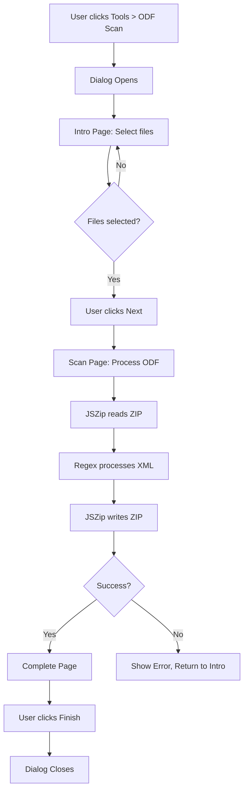

# Design Document: Zotero 7 Migration Completion

## Overview

This design addresses the remaining blocking issues for Zotero 7 compatibility:
1. Replace deprecated XPCOM ZIP APIs with JSZip
2. Simplify the wizard to ODF-only mode (3 pages: intro → scan → complete)
3. Remove dead code referencing non-existent UI elements
4. Ensure all localization flows through Fluent

The design follows the established patterns from the Make It Red sample plugin and Zotero 7 developer documentation.

## Steering Document Alignment

### Technical Standards (tech.md)
- **Bootstrap Extension Pattern**: Already implemented correctly in bootstrap.js
- **JavaScript ES6+**: Continuing with plain JavaScript (no TypeScript)
- **JSZip for ZIP Handling**: Per tech.md decision log, JSZip replaces XPCOM nsIZipReader/nsIZipWriter
- **Fluent Localization**: Already set up with odf-scan.ftl

### Project Structure (structure.md)
- **content/**: Dialog scripts and UI (rtfScan.js, rtfScan.xhtml, rtfScan.css)
- **content/lib/**: New location for JSZip library (vendored)
- **locale/**: Fluent .ftl files
- **resource/translators/**: Scannable Cite translator

### JSZip Library Acquisition
- **Source:** Download jszip.min.js from https://github.com/Stuk/jszip/releases (v3.10.1 or latest stable)
- **Destination:** `content/lib/jszip.min.js` (vendored, ~100KB minified)
- **Rationale:** Vendored rather than npm because plugin has no bundler; script loads directly in XHTML
- **Build.py Update Required:** Add `content/lib/**/*` to files_to_include glob pattern

## Code Reuse Analysis

### Existing Components to Leverage
- **Zotero.ODFScan.WizardController**: Already implemented in odf-scan.js, provides page navigation
- **content/rtfScan.js ODFConv class**: Core conversion logic with regex patterns - KEEP but replace ZIP methods
- **content/rtfScan.js Fragment class**: Citation parsing - KEEP as-is
- **Zotero.File APIs**: Use getContentsAsync/putContentsAsync for file I/O

### Integration Points
- **Zotero.Prefs**: Already integrated for storing last file paths
- **Zotero.File**: Use for reading/writing files (getContentsAsync, putContentsAsync)
- **FilePicker**: Already used for file selection dialogs

## Architecture

The plugin follows a simple flow:



### Modular Design Principles
- **Single File Responsibility**:
  - odf-scan.js: Plugin lifecycle, menu, dialog opening
  - rtfScan.js: Wizard controller, ODF conversion logic
  - jszip.min.js: ZIP handling library
- **Component Isolation**: WizardController separate from ODFConv
- **Clear Interfaces**: ODFConv.convert() returns true/false, handles own ZIP I/O

## Components and Interfaces

### Component 1: JSZip Integration Module
- **Purpose:** Provides async ZIP read/write replacing XPCOM APIs
- **Location:** content/lib/jszip.min.js (library) + helper functions in rtfScan.js
- **Interfaces:**
  ```javascript
  // Read ODF archive
  async function readODFContent(inputPath) → {content: string, meta: string|null}

  // Write ODF archive
  async function writeODFContent(inputPath, outputPath, content, meta) → void
  ```
- **Dependencies:** JSZip library, Zotero.File APIs
- **Reuses:** Existing file path handling from rtfScan.js

### Component 2: Simplified ODFConv Class
- **Purpose:** Converts between citation markers and Zotero references in ODF XML
- **Location:** content/rtfScan.js (refactored)
- **Interfaces:**
  ```javascript
  ODFConv.prototype.convert() → boolean  // Main conversion entry point
  ODFConv.prototype.readZipfileContent() → Promise<void>  // Uses JSZip
  ODFConv.prototype.writeZipfileContent() → Promise<void> // Uses JSZip
  ```
- **Dependencies:** JSZip helper functions, Zotero.File
- **Reuses:** Existing regex patterns, Fragment class, XML manipulation

### Component 3: WizardController (existing)
- **Purpose:** Manages wizard page navigation and button states
- **Location:** content/odf-scan.js (Zotero.ODFScan.WizardController)
- **Interfaces:**
  ```javascript
  goToPage(pageId) → void
  advance() → void
  rewind() → void
  setCanAdvance(boolean) → void
  ```
- **Dependencies:** DOM (document.getElementById)
- **Reuses:** Already implemented, no changes needed

### Component 4: Zotero_ODFScan Dialog Controller
- **Purpose:** Handles UI events, file selection, initiates conversion
- **Location:** content/rtfScan.js (Zotero_ODFScan object)
- **Interfaces:**
  ```javascript
  init() → void
  chooseInputFile() → Promise<void>
  chooseOutputFile() → Promise<void>
  fileTypeSwitch(mode) → void
  ```
- **Dependencies:** WizardController, FilePicker, ODFConv
- **Reuses:** Existing file selection logic

## Data Models

### ODF File Structure
```
ODF Archive (ZIP):
├── content.xml    # Main document content with citation markers/references
├── meta.xml       # Document metadata (optional, may contain Zotero config)
├── styles.xml     # Document styles
├── mimetype       # File type declaration
└── [other files]  # Images, settings, etc.
```

### Citation Marker Format
```
Scannable Cite Marker:
{ prefix | readable-cite | locator | suffix | zotero-item-key }

Examples:
{ | Smith, A Title (2003) | | | zotero://select/items/0_AXVB9R }
{ *See* | Jones, Another (2020) | p. 45 | (emphasis added) | zu:0:BCDEFG }
{ | -Author, Title (2021) | | | zu:0:HIJKLM }  // suppress author with leading -
```

### Zotero Reference Mark Format
```xml
<text:reference-mark-start text:name="ZOTERO_ITEM CSL_CITATION {...json...}"/>
citation text
<text:reference-mark-end text:name="ZOTERO_ITEM CSL_CITATION {...json...}"/>
```

## Error Handling

### Error Scenarios

1. **Invalid/Corrupted ODF File**
   - **Detection:** JSZip fails to parse or content.xml missing
   - **Handling:** Catch exception, show error message, return to intro page
   - **User Impact:** Red error text: "There was an error processing this file"

2. **Output File Write Failure**
   - **Detection:** Zotero.File.putContentsAsync throws
   - **Handling:** Catch exception, show error, don't advance wizard
   - **User Impact:** Error message with details, can retry or cancel

3. **No Citations Found**
   - **Detection:** Regex patterns match nothing in content.xml
   - **Handling:** Not an error - still write output file (passthrough)
   - **User Impact:** Complete page shows success (file was processed, just had no markers)

4. **File Already Open/Locked**
   - **Detection:** Write operation fails with permission error
   - **Handling:** Show specific error message about closing the file
   - **User Impact:** "Please close the output file and try again"

## Implementation Details

### JSZip Integration

Bundle the minified JSZip distribution under `content/lib/jszip.min.js` (committed to source control). This keeps the plugin self-contained without requiring npm bundling.

JSZip will be loaded as a script in the XHTML dialog:
```html
<script src="lib/jszip.min.js"></script>
```

Helper functions in rtfScan.js:
```javascript
async function readODFContent(inputFile) {
    const data = await Zotero.File.getBinaryContentsAsync(inputFile.path);
    const zip = await JSZip.loadAsync(data);
    const content = await zip.file("content.xml").async("string");
    const metaFile = zip.file("meta.xml");
    const meta = metaFile ? await metaFile.async("string") : null;
    return { content, meta };
}

async function writeODFContent(inputPath, outputPath, content, meta) {
    const data = await Zotero.File.getBinaryContentsAsync(inputPath);
    const zip = await JSZip.loadAsync(data);
    zip.file("content.xml", content);
    if (meta) {
        zip.file("meta.xml", meta);
    }
    const output = await zip.generateAsync({type: "uint8array"});
    await Zotero.File.putContentsAsync(outputPath, output);
}
```

### Dead Code Removal

Remove or guard the following from rtfScan.js:
- `citationsPageShowing()` - RTF-only, references tree element
- `treeClick()` - XUL tree interaction
- `stylePageShowing()` - RTF-only, references style-listbox
- `formatPageShowing()` - RTF formatting
- `_generateItem()` - Creates XUL treeitem elements
- References to: `unmappedCitationsItem`, `ambiguousCitationsItem`, `mappedCitationsItem`
- References to: `tree`, `treechildren`, `style-listbox`

### Localization Keys Used

All these keys must exist in locale/en-US/odf-scan.ftl (add any missing keys before implementation):

**Already Present (confirmed in odf-scan.ftl):**
- `odf-scan-title` ✓
- `odf-scan-toolbar-label` ✓
- `odf-scan-intro-page-label` ✓
- `odf-scan-input-file-label` ✓ (maps to `odf-scan-input-file`)
- `odf-scan-output-file-label` ✓ (maps to `odf-scan-output-file`)
- `odf-scan-file-choose-label` ✓ (maps to `odf-scan-choose-file`)
- `odf-scan-file-none-selected-label` ✓ (maps to `odf-scan-no-file-selected`)
- `odf-scan-scan-page-label` ✓
- `odf-scan-scan-page-description` ✓ (maps to `odf-scan-scan-description`)
- `odf-scan-complete-page-label` ✓
- `odf-scan-complete-page-description` ✓ (maps to `odf-scan-complete-description`)
- `odf-scan-file-type-odf` ✓
- `odf-scan-file-type-rtf` ✓

**Missing - Need to Add:**
- `odf-scan-file-type-label` - "File type"
- `odf-scan-odf-to-citations` - "ODF (to citations)"
- `odf-scan-odf-to-markers` - "ODF (to markers)"
- `odf-scan-file-error` - "There was an error processing this file"
- `odf-scan-back-button` - "Back"
- `odf-scan-cancel-button` - "Cancel"
- `odf-scan-next-button` - "Next"
- `odf-scan-finish-button` - "Finish"
- `odf-scan-intro-description-start` - (intro description text)
- `odf-scan-intro-link` - "the ODF Scan documentation"
- `odf-scan-intro-description2` - "Select the input file..."
- `odf-scan-intro-example1/2/3` - (example descriptions)

## Testing Strategy

### Manual Testing (Primary)
Since there's no automated test framework:

1. **Installation Test**
   - Build XPI: `python3 build.py`
   - Install in Zotero 7
   - Verify no console errors on load
   - Verify Tools > ODF Scan menu appears

2. **ODF to Citations Test**
   - Create test ODF with scannable cite markers
   - Run conversion
   - Verify output contains Zotero reference marks

3. **ODF to Markers Test**
   - Use output from test 2 as input
   - Run reverse conversion
   - Verify markers are restored

4. **Error Handling Test**
   - Try invalid file (not a ZIP)
   - Try missing input file
   - Verify graceful error display

### Code Quality
- Run `npm install` to get ESLint
- Run `npm test` to lint all JavaScript files
- Fix any ESLint errors before committing

### Build Verification
- `python3 build.py` creates valid XPI
- XPI contains: bootstrap.js, manifest.json, prefs.js, content/*, locale/*, content/icons/*, `content/lib/jszip.min.js`, resource/translators/*

**Verify JSZip is Included:**
After building, extract the XPI (it's a ZIP) and confirm:
```bash
unzip -l zotero-odf-scan-v*.xpi | grep jszip
# Should show: content/lib/jszip.min.js
```
