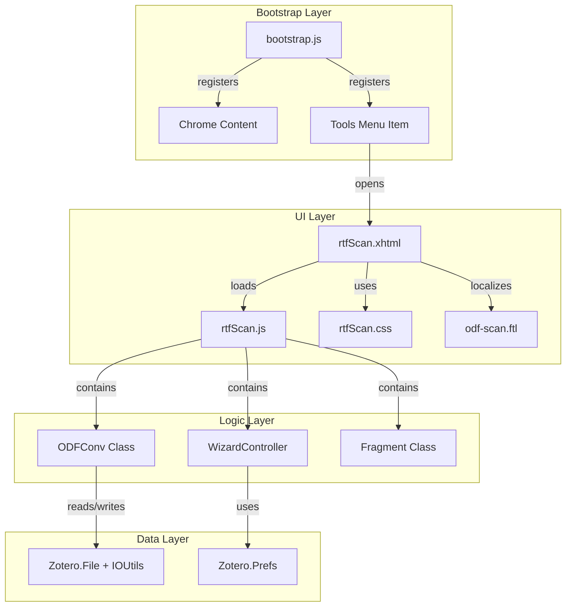

# Design Document

## Overview

This design document describes the technical architecture for migrating the ODF Scan plugin from Zotero 6 to Zotero 7. The migration follows **Option B (Minimal Migration)** as documented in `ZOTERO7_MIGRATION_PLAN.md`:
- Keep JavaScript (no TypeScript)
- Simple build approach
- Convert XUL to XHTML manually
- Keep existing code structure mostly intact

The migration transforms the plugin from a XUL-based extension to an XHTML-based one while preserving all core conversion logic.

## Steering Document Alignment

### Technical Standards (tech.md)

Following the documented technical decisions:
- **Minimal Migration (Option B)**: JavaScript only, manual XUL→XHTML conversion
- **JSZip for ZIP Handling**: Replace XPCOM nsIZipReader/nsIZipWriter
- **Wizard UI Pattern**: Multi-step XHTML dialog replacing XUL wizard
- **Bootstrap Pattern**: Follow Zotero 7 lifecycle hooks

### Project Structure (structure.md)

Target structure after migration:
```
zotero-odf-scan-plugin/
├── bootstrap.js              # Updated for Z7 lifecycle
├── manifest.json             # Z7 manifest (already exists)
├── prefs.js                  # Default preferences
├── content/
│   ├── rtfScan.xhtml         # Converted from XUL
│   ├── rtfScan.js            # Updated for Z7 APIs
│   └── rtfScan.css           # Styles for wizard UI
├── locale/
│   └── en-US/
│       └── odf-scan.ftl      # Fluent localization
├── resource/
│   └── translators/
│       └── Scannable Cite.js # Unchanged
└── package.json              # Updated dependencies
```

## Code Reuse Analysis

### Existing Components to Leverage

- **rtfScan.js Core Logic**: The `_scanODF()` function, `Fragment` class, and `ODFConv` class contain working citation parsing and conversion logic that should be preserved with minimal changes.

- **Regex Patterns**: All citation detection patterns are working and tested:
  - `rexText`, `rexTextAll` - Plain text markers
  - `rexLink`, `rexLink2` - Linked markers
  - `rexNativeLink` - Native Zotero references

- **Scannable Cite.js**: Export translator is independent of Z7 changes and works as-is.

### Integration Points

- **Zotero.Prefs**: Preference API unchanged, existing pref keys preserved
- **Zotero.File**: File API for reading/writing, largely compatible
- **Zotero.Translators**: Translator registration API unchanged
- **FilePicker**: Already uses Zotero's FilePicker module (compatible)

## Architecture

### High-Level Component Diagram



### Modular Design Principles

- **Single File Responsibility**:
  - `bootstrap.js` - Plugin lifecycle only
  - `rtfScan.js` - Conversion logic and UI control
  - `rtfScan.xhtml` - UI structure only
  - `rtfScan.css` - Styling only

- **Component Isolation**: Wizard pages are isolated `<div>` sections with show/hide logic

- **Utility Separation**: Localization helper functions separated from business logic

## Components and Interfaces

### Component 1: bootstrap.js

- **Purpose**: Plugin lifecycle management, chrome registration, menu injection
- **Interfaces**:
  ```javascript
  async function startup({ id, version, resourceURI, rootURI }, reason)
  async function onMainWindowLoad({ window }, reason)
  async function onMainWindowUnload({ window }, reason)
  async function shutdown({ id, version, resourceURI, rootURI }, reason)
  function install(data, reason)
  function uninstall(data, reason)
  ```
- **Dependencies**: Zotero, Services, Components.interfaces.amIAddonManagerStartup
- **Pattern**: Based on zotero-plugin-template/addon/bootstrap.js

### Component 2: rtfScan.xhtml (Wizard Dialog)

- **Purpose**: Multi-step wizard UI for ODF conversion
- **Structure**:
  ```html
  <window>
    <linkset> <!-- Fluent localization -->
    <div id="wizard-container">
      <div id="intro-page" class="wizard-page">...</div>
      <div id="scan-page" class="wizard-page">...</div>
      <div id="complete-page" class="wizard-page">...</div>
    </div>
    <div id="wizard-buttons">
      <button id="back-button">Back</button>
      <button id="next-button">Next</button>
      <button id="finish-button">Finish</button>
    </div>
  </window>
  ```
- **XUL to XHTML Mapping**:
  | XUL Element | XHTML Equivalent |
  |-------------|------------------|
  | `<wizard>` | `<div id="wizard-container">` + JS logic |
  | `<wizardpage>` | `<div class="wizard-page">` |
  | `<groupbox>` | `<fieldset>` |
  | `<caption>` | `<legend>` |
  | `<radiogroup>` | `<div class="radio-group">` |
  | `<radio>` | `<input type="radio">` + `<label>` |
  | `<textbox>` | `<input type="text" readonly>` |
  | `<button>` | `<button>` |
  | `<progressmeter>` | `<progress>` |
  | `<description>` | `<p>` |

### Component 3: rtfScan.js (Conversion Logic)

- **Purpose**: ODF parsing, citation conversion, wizard state management
- **Interfaces** (Public API on `Zotero_ODFScan`):
  ```javascript
  // Wizard page handlers
  this.introPageShowing = function()
  this.introPageAdvanced = function()
  this.scanPageShowing = function()
  this.citationsPageShowing = function()

  // User actions
  this.chooseInputFile = async function()
  this.chooseOutputFile = async function()
  this.fileTypeSwitch = function(mode)

  // Wizard navigation (NEW)
  this.goToPage = function(pageId)
  this.canAdvance = function()
  this.advance = function()
  this.rewind = function()
  ```
- **Internal Classes** (preserved from existing code):
  - `Fragment` - Text manipulation for citation normalization
  - `ODFConv` - Main ODF conversion processor
- **Changes Required**:
  - Replace XPCOM ZIP handling with Zotero.File/IOUtils
  - Update DOM queries for XHTML elements
  - Add wizard navigation logic (previously handled by XUL `<wizard>`)
  - Update localization to use Fluent

### Component 4: Localization (odf-scan.ftl)

- **Purpose**: All user-facing strings in Fluent format
- **Interface**: `data-l10n-id` attributes in XHTML, `getString()` in JS
- **Migration from DTD/properties**:
  ```ftl
  # From: <!ENTITY zotero.rtfScan.title "ODF Scan">
  # To:
  odf-scan-title = ODF Scan

  # From: zotero.rtfScan.inputFile.label=Input File
  # To:
  odf-scan-input-file = Input File
  ```

## Data Models

### Wizard State
```javascript
{
  currentPage: string,      // "intro" | "scan" | "complete"
  fileType: string,         // "odf"
  outputMode: string,       // "tocitations" | "tomarkers"
  inputFile: nsIFile | null,
  outputFile: nsIFile | null,
  canAdvance: boolean,
  error: string | null
}
```

### Citation Item (internal)
```javascript
{
  prefix: string,
  locator: string,
  suffix: string,
  key: string,              // e.g., "zu:0:ITEMKEY" or "zotero://select/items/..."
  "suppress-author": boolean,
  uri: string[],
  uris: string[]
}
```

## API Changes: XPCOM to Modern

### ZIP File Reading

**Before (XPCOM)**:
```javascript
let zipReader = Components.classes["@mozilla.org/libjar/zip-reader;1"]
    .createInstance(Components.interfaces.nsIZipReader);
zipReader.open(inputFile);
let inputStream = zipReader.getInputStream("content.xml");
let content = Zotero.File.getContents(inputStream);
zipReader.close();
```

**After (Zotero 7)**:
```javascript
// Option A: Use Zotero's built-in ZIP support
let zipReader = Zotero.File.createZipReader(inputFile.path);
let content = await zipReader.getEntry("content.xml");
zipReader.close();

// Option B: Use IOUtils (if Zotero.File doesn't support ZIP)
let data = await IOUtils.read(inputFile.path);
// Process with available ZIP API
```

### ZIP File Writing

**Before (XPCOM)**:
```javascript
let zipWriter = Components.classes["@mozilla.org/zipwriter;1"]
    .createInstance(Components.interfaces.nsIZipWriter);
zipWriter.open(outputFile, 0x04);
zipWriter.removeEntry("content.xml", false);
zipWriter.addEntryStream("content.xml", 0, 9, istream, false);
zipWriter.close();
```

**After (Zotero 7)**:
```javascript
// Copy input to output, then modify
await IOUtils.copy(inputFile.path, outputFile.path);
// Use Zotero's ZIP utilities or file replacement
let zipWriter = Zotero.File.createZipWriter(outputFile.path);
await zipWriter.removeEntry("content.xml");
await zipWriter.addEntry("content.xml", contentString);
await zipWriter.close();
```

### Localization Access

**Before (StringBundle)**:
```javascript
let stringBundleService = Components.classes["@mozilla.org/intl/stringbundle;1"]
    .getService(Components.interfaces.nsIStringBundleService);
let bundle = stringBundleService.createBundle("chrome://.../zotero.properties");
let str = bundle.GetStringFromName("key");
```

**After (Fluent)**:
```javascript
// In XHTML - automatic via data-l10n-id
<span data-l10n-id="odf-scan-title"></span>

// In JS - using Zotero's getString or document.l10n
let str = await document.l10n.formatValue("odf-scan-title");
// Or if ztoolkit is available:
let str = getString("odf-scan-title");
```

## Error Handling

### Error Scenarios

1. **Invalid ODF File**
   - **Handling**: Catch ZIP read errors, display localized error message
   - **User Impact**: "There was an error processing this file" shown on intro page
   - **Recovery**: User can select a different file

2. **File Write Permission Error**
   - **Handling**: Catch IOUtils write errors
   - **User Impact**: Error message with path shown
   - **Recovery**: User can choose different output location

3. **Malformed Citation Markers**
   - **Handling**: Regex non-match skips marker silently (existing behavior)
   - **User Impact**: Unconverted markers remain as-is in output
   - **Recovery**: User can manually fix markers

4. **Dialog Closed Mid-Scan**
   - **Handling**: Check for window closure, abort processing
   - **User Impact**: Partial output file may exist
   - **Recovery**: User can delete partial file and retry

## Testing Strategy

### Manual Testing Checklist

1. **Installation**
   - [ ] XPI installs in Zotero 7 without errors
   - [ ] Menu item appears in Tools menu
   - [ ] Menu item opens dialog

2. **ODF to Citations**
   - [ ] File picker opens and filters .odt files
   - [ ] Scan progress shows
   - [ ] Output file contains reference marks
   - [ ] Citation data (prefix, locator, suffix) preserved

3. **ODF to Markers**
   - [ ] Converts reference marks back to scannable markers
   - [ ] All fields preserved in output

4. **Error Cases**
   - [ ] Non-ODF file shows error
   - [ ] Cancel button works at each step
   - [ ] Window close cleans up properly

### Integration Testing

- Test with sample ODF files containing:
  - Single citation
  - Multiple citations in one location
  - Citations with prefixes/suffixes/locators
  - Suppress-author citations
  - Mixed marker formats

### Regression Testing

- Compare output of Z6 and Z7 versions on identical input files
- Verify round-trip: ODF → markers → citations → markers produces same result
